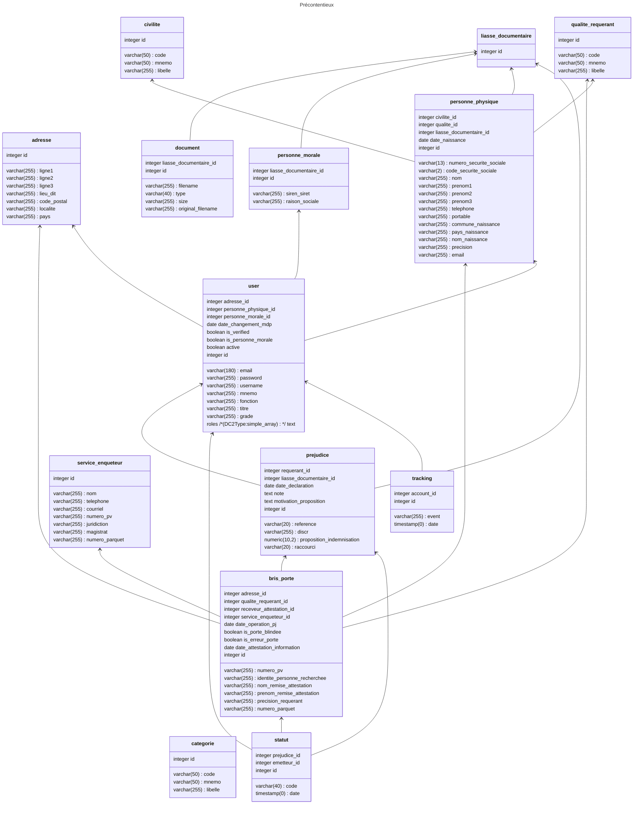

# Base de données

## Schéma actuel

```mermaid
---
title: Précontentieux
---
classDiagram
direction BT
class adresse {
   varchar(255) ligne1
   varchar(255) ligne2
   varchar(255) ligne3
   varchar(255) lieu_dit
   varchar(255) code_postal
   varchar(255) localite
   varchar(255) pays
   integer id
}
class bris_porte {
   integer adresse_id
   integer qualite_requerant_id
   integer receveur_attestation_id
   integer service_enqueteur_id
   varchar(255) numero_pv
   date date_operation_pj
   boolean is_porte_blindee
   boolean is_erreur_porte
   varchar(255) identite_personne_recherchee
   varchar(255) nom_remise_attestation
   varchar(255) prenom_remise_attestation
   varchar(255) precision_requerant
   date date_attestation_information
   varchar(255) numero_parquet
   integer id
}
class categorie {
   varchar(50) code
   varchar(50) mnemo
   varchar(255) libelle
   integer id
}
class civilite {
   varchar(50) code
   varchar(50) mnemo
   varchar(255) libelle
   integer id
}
class document {
   integer liasse_documentaire_id
   varchar(255) filename
   varchar(40) type
   varchar(255) size
   varchar(255) original_filename
   integer id
}
class liasse_documentaire {
   integer id
}
class personne_morale {
   integer liasse_documentaire_id
   varchar(255) siren_siret
   varchar(255) raison_sociale
   integer id
}
class personne_physique {
   integer civilite_id
   integer qualite_id
   integer liasse_documentaire_id
   varchar(13) numero_securite_sociale
   varchar(2) code_securite_sociale
   varchar(255) nom
   varchar(255) prenom1
   varchar(255) prenom2
   varchar(255) prenom3
   varchar(255) telephone
   varchar(255) portable
   varchar(255) commune_naissance
   varchar(255) pays_naissance
   date date_naissance
   varchar(255) nom_naissance
   varchar(255) precision
   varchar(255) email
   integer id
}
class prejudice {
   integer requerant_id
   integer liasse_documentaire_id
   date date_declaration
   varchar(20) reference
   varchar(255) discr
   text note
   numeric(10,2) proposition_indemnisation
   text motivation_proposition
   varchar(20) raccourci
   integer id
}
class qualite_requerant {
   varchar(50) code
   varchar(50) mnemo
   varchar(255) libelle
   integer id
}
class service_enqueteur {
   varchar(255) nom
   varchar(255) telephone
   varchar(255) courriel
   varchar(255) numero_pv
   varchar(255) juridiction
   varchar(255) magistrat
   varchar(255) numero_parquet
   integer id
}
class statut {
   integer prejudice_id
   integer emetteur_id
   varchar(40) code
   timestamp(0) date
   integer id
}
class tracking {
   integer account_id
   varchar(255) event
   timestamp(0) date
   integer id
}
class user {
   integer adresse_id
   integer personne_physique_id
   integer personne_morale_id
   varchar(180) email
   varchar(255) password
   varchar(255) username
   date date_changement_mdp
   boolean is_verified
   varchar(255) mnemo
   varchar(255) fonction
   varchar(255) titre
   varchar(255) grade
   boolean is_personne_morale
   boolean active
   roles  /* (DC2Type:simple_array) */ text
   integer id
}

bris_porte  -->  adresse
bris_porte  -->  personne_physique
bris_porte  -->  prejudice
bris_porte  -->  qualite_requerant
bris_porte  -->  service_enqueteur
document  -->  liasse_documentaire
personne_morale  -->  liasse_documentaire
personne_physique  -->  civilite
personne_physique  -->  liasse_documentaire
personne_physique  -->  qualite_requerant
prejudice  -->  liasse_documentaire
prejudice  -->  user
statut  -->  bris_porte
statut  -->  prejudice
statut  -->  user
tracking  -->  user
user  -->  adresse
user  -->  personne_morale
user  -->  personne_physique
```