# Structure du projet

## Backend: Symfony

Le projet a été initié en Symfony. On utilise donc Doctrine pour s'interfacer avec la base de données PostgreSQL.

On dispose des migrations Doctrine, ainsi que des _fixtures_ de données et du [`doctrine-test-bundle`](https://github.com/dmaicher/doctrine-test-bundle) pour les tests.

Le projet a débuté avec API Platform, qui est actuellement utilisé uniquement pour le patch d'un dossier (au préalable
initié avec toutes les entités liées). On souhaite s'en affranchir à moyen terme.

Pour s'interfacer avec les assets du [frontend](#Frontend-Twig-et-React), eux même construits par Vite, on utlise le
[Pentatrion Vite Bundle](https://symfony-vite.pentatrion.com/).   

## Frontend: Twig et React

Si les premières pages ont été générées depuis le backend via des _gabarits_ Twig, les pages sont majoritairement générées
avec React.

La migration vers React se fait, page par page, à l'aide [du routeur `tanstack-router`](https://tanstack.com/router/latest).
Chaque espace possède ses propres routes, l'authentification côté serveur s'occupant de servir la bonne application React.  

## Architecture technique

Le serveur sert en même temps des pages HTML que les routes d'API exposées à chacune des applications :
* espace requérant : destiné à l'usager
* espace agent FIP6 ⚖️ : permet aux agents du Bureau du précontentieux d'instruire les dossiers
* espace agent FDO 👮 : où les agents des Forces de l'Ordre peuvent déclarer un bris de porte

La connexion des agents de l'état se fait avec [ProConnect](https://www.proconnect.gouv.fr/), lequel renvoie vers la mire d'authentification du Ministère concerné.

Les usagers pour leur part peuvent créer leur compte par courriel et mot de passe ou [au moyen FranceConnect](https://www.franceconnect.gouv.fr/).

Les données sont stockées sur un serveur PostgreSQL (v15.4) et les documents (pièces jointes et documents administratifs)
sont enregistrés sur un bucket S3.

Les courriels _transactionnels_, envoyés par la plateforme, sont distribués par Brevo, via [un relais SMTP](https://help.brevo.com/hc/en-us/articles/7924908994450-Send-transactional-emails-using-Brevo-SMTP).

```mermaid
architecture-beta
    group mij(internet)[API]

    service serveur(server)[Serveur] in mij
    service db(databse)[Base de donnees] in mij
    service storage(disk)[Stockage] in mij

    group brevo(internet)[Brevo]

    service smtp(server)[SMTP] in brevo

    group franceconnect(logos:aws-lambda)[France Connect]

    service fc(server)[SSO] in franceconnect

    group proconnect(logos:aws-lambda)[Pro Connect]

    service pc(server)[SSO] in proconnect

    serveur:T -- B:db
    serveur:T -- B:storage
    serveur:R -- L:smtp
    serveur:R -- L:fc
    serveur:R -- L:pc

```

