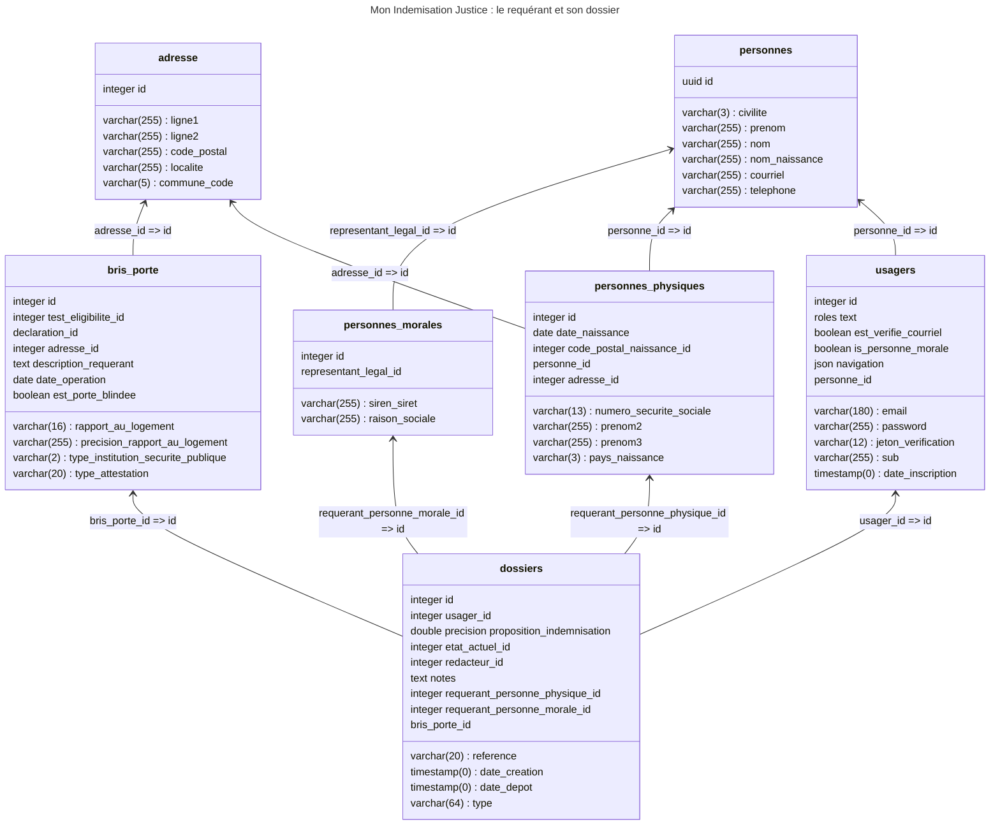

# Base de données

## Le requérant et son dossier

Un **usager** peut créer son compte sur la plateforme et ainsi déposer un **dossier** de demande d'indemnisation. La
table `usagers` contient ainsi principalement des informations en relation avec la plateforme (mot de passe, jeton pour
la vérification de l'adresse courriel, etc...).

Un usager est également une **personne** dont la tables `personnes` recense les informations de base de l'état civil.
Lorsqu'il dépose un dossier à son nom, l'usager lie son dossier à sa **personne physique**, la table `personnes_physiques`
étend donc les données de personnes avec les informations de naissance (date, pays et ville ou commune, si né•e en France.

Un dossier, de la table`dossiers`, possède une référence, un état actuel (voir après ["États d'un dossier"](#"États d'un dossier"))
et est présentement _forcément_ de type `BRIS_PORTE` et donc associé à une entrée de la table `bris_porte` qui contient
les informations spécifiques aux préjudices de portes brisées (date de l'opération de police judiciaire, adresse, porte
blindée ou non, etc...).

Puisque chaque dossier est déposé par un usager au nom d'une personne physique ou d'une personne morale, on peut rapidement
savoir si la `personnes` associée à la personne physique ou si le représentant légal de la personne morale est l'usager
ou s'il s'agit d'une délégation un d'un mandat.  

## États d'un dossier

TODO : à compléter