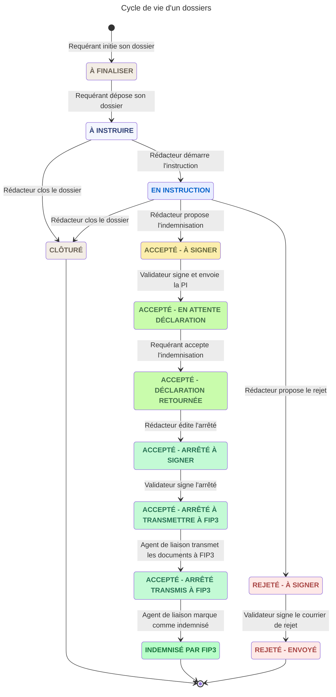

# Cycle de vie d'un dossiers

## Les différents états

Voici la liste des différents états par lesquels passe un dossier :
- **À finaliser** (`A_FINALISER`): le dossier a été initié par le requérant et est en cours de complétion
- **À instruire** (`A_INSTRUIRE`): le requérant a déposé son dossier. Il est désormais à instruire par le rédacteur qui lui est attribué
- **En cours d'instruction** (`EN_INSTRUCTION`): quand le rédacteur démarre l'instruction, il marque le dossier en cours d'instruction. Il a
alors accès aux coordonnées du requérant ainsi que la prise de notes sur le dossier
- **Clôturé** (`CLOTURE`): le dossier a été clôturé et ne sera pas traité. Ex: pas pertinent car ne concerne pas un
dossier de bris de porte ou est déjà traité en version papier 
- **Accepté - à signer** (`OK_A_SIGNER`): le rédacteur accepte la demande en rédigeant une première de la proposition d'indemnisation 
- **Accepté - en attente déclaration** (`OK_A_APPROUVER`): le validateur peut également éditer le PI et signe électroniquement
le document, lequel est transmis au requérant via son espace
- **Accepté - déclaration retournée** (`OK_A_VERIFIER`): le requérant a accepté la proposition en retournant la déclaration
d'acceptation depuis son espace. Le rédacteur la valide puis édite une première version de l'arrêté de paiement  
- **Accepté - arrêté à signer** (`OK_VERIFIE`): le validateur peut également éditer l'arrêté mais surtout le signe électroniquement 
- **Accepté - arrêté à transmettre à FIP3** (`OK_A_INDEMNISER`): l'agent de liaison récupère les documents nécessaires à
l'établissement du virement et les transmet à FIP3
- **Accepté - arrêté transmis à FIP3** (`OK_EN_ATTENTE_PAIEMENT`): l'agent de liaison vérifie régulièrement auprès de FIP3
si le virement a été effectué
- **Indemnisé par FIP3** (`OK_INDEMNISE`): l'indemnisation est virée sur le compte du requérant, le dossier est terminée  
- **Rejeté - à signer** (`KO_A_SIGNER`): le rédacteur propose un rejet et initie un courrier de décision en ce sens
- **Rejeté - envoyé** (`KO_REJETE`): le validateur peut éditer le courrier de décision et le signe pour qu'il soit envoyé
au requérant

## Diagramme d'états

