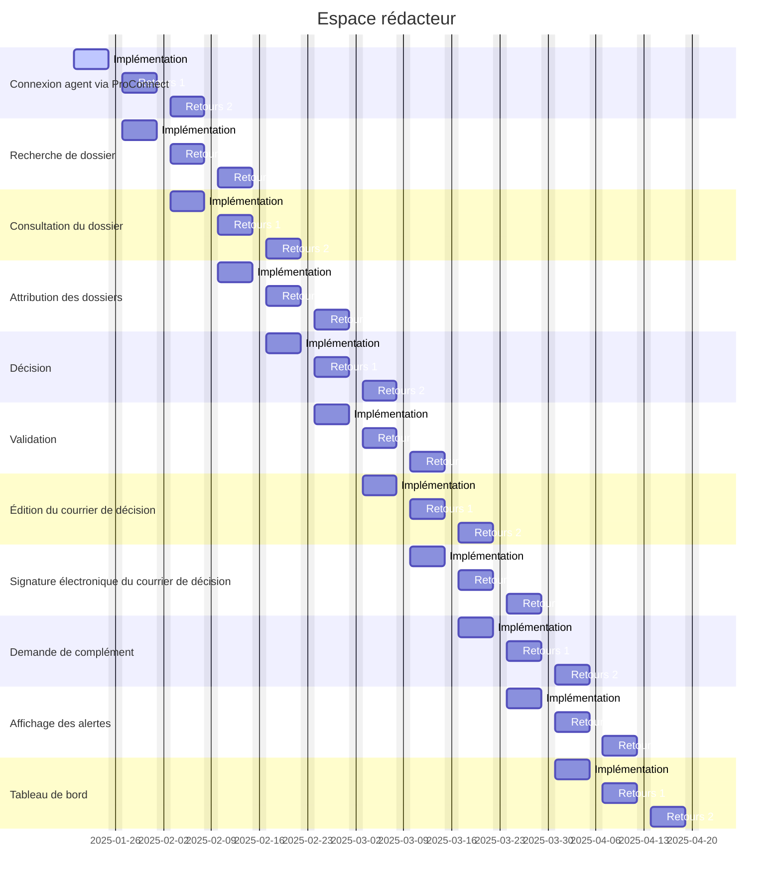

# Projets

## Espace Rédacteur

### Description

Afin de mener l'instruction des dossiers d'indemnisation, nous souhaitons implément un espace dédié aix rédacteurs. À ce
stade, nous considérons que les dossiers concernent uniquement les préjudices de bris de porte.

### Organisation

Nous suivrons une logique à mi-chemin entre Scrum et Kanban. Chaque étape du projet est définie pour couvrir une semaine
de développement. Dans une logique d'itération, on se garde 2 fois une semaine pour traiter les retours qui émaneront de
la première semaine d'implémentation.

Cette organisation a pour objectif de forcer une mise à jour de la base de code, et
idéalement le déploiement idoine, incluant la fonctionnalité nominale même dans un état inachevé ou simplifié. 

Si jamais une étape du projet est repensée pour impliquer plus de développement, alors on doit la scinder en 2 étapes
afin de garantir que chaque étape possède sa propre ligne sur la feuille de route.

### Feuille de route

Les étapes identifiées à date sont les suivantes :

#### Connexion via ProConnect

Permettre aux agents de s'identifier via [ProConnect](https://www.proconnect.gouv.fr/). Notamment :
* aux agents du Ministère de la Justice d'intervenir sur les dossiers d'indemnisation (rédacteur, attributeur, validateur
ou coordinateur) 
* aux agents des Forces de l'Ordre (Police Judiciaire, Gendarmerie Nationale) de télécharger l'attestation usager ainsi
que le guide de remise

Étant donné que quiconque disposant d'un accès à ProConnect aura donc accès à l'espace agent, une étape de demande et de
validation de droit est à intégrer afin d'assurer de la bonne distribution de permissions.

#### Recherche des dossiers

Permettre aux agents du MJ d'afficher la liste des dossiers, avec les infos clefs comme le rédacteur attribué, le statut,
identité (nom / prénom / adresse) du requérant, le type de préjudice (= code NAC). Intégrer avec le tri et le filtre sur
les mêmes infos.  

> [!NOTE]
> À cette étape il n'est pas encore possible de consulter le dossier (à venir avec [la consultation du dossier](#consultation-du-dossier))
    
#### Consultation du dossier

Consulter les détails d'un dossier : identité du requérant, date et contexte du bris de porte ainsi que la visualisation
des documents en pièce jointe.

Pour la traçabilité, une zone de pavé de texte permet aux agents disposant de l'accès au dossier (rôle `AGENT_REDACTEUR`)
de consigner des notes de suivi de dossier. 

> [!NOTE]
> À cette étape aucune action, autre que la prise de note, n'est disponible (à venir à partir de [la décision](#décision))
    
#### Attribution des dossiers

Réserver aux agents disposant d’un rôle `ROLE_ATTRIBUTEUR` d'attribuer un dossier à un rédacteur. On souhaite pouvoir
ré-attribuer un dossier _a posteriori_ à un autre rédacteur à tout moment (en cas de congés ou de spécialisation technique
requise).

On ne passera pas par la vue recherche pour attribuer, mais via une vue en liste dédiée, favorisant les actions groupées.
Puisque l'opération d'attribution risque d'occasionner des altérations successives, les affectations sont validées et
sauvegardées après l’appui d’un bouton  _"Valider”_ (occasionnant le rafraichissement de la liste, les dossiers attribués
disparaissant alors). Un message doit donc s'afficher lorsqu’on quitte la page bien que des attributions soient en cours. 

Le critères d’attribution du dossier est la complexité, dans le cas des dysfonctionnements notamment (pas applicable aux
bris de porte). Pour faciliter la prise de décision, on prévoit d'inclure une modale affichant les détails du dossier
en vue d’attribuer selon la difficulté / séniorité requise, évitant d'avoir à ouvrir la page de consultation du dossier
dans un autre onglet.
    
#### Décision

Permettre aux agents rédacteurs de statuer : 
* indemniser avec un montant, via un courrier de proposition d’indemnisation
* rejeter la demande, via un courrier de décision de rejet

La décision n'est pas encore transmise au requérant, elle est sujette à [validation](#validation)

> [!NOTE]
> À cette étape un courrier est généré avec les infos du dossier ainsi que du requérant pour prévisualisation (pas
> d'envoi au requérant à ce stade), mais il ne sera possible de le personnaliser qu'à l'étape de
> [l'édition du courrier de décision](#édition-du-courrier-de-décision)
    
#### Validation

Introduire l'action de validation d'un dossier, par la cheffe de pôle ou d'un agent disposant du rôle `AGENT_VALIDATEUR`. 

Il sera également permis à l'agent connecté de faire des _observations_ sur le dossier : dans ce cas le dossier retourne
en phase de décision chez le rédacteur.
    
#### Édition du courrier de décision

Permet au rédacteur comme au validateur d'éditer le corps du courrier de décision afin d'affiner le contenu en fonction
du contexte.

#### Signature électronique du courrier de décision

L'agent validateur peut télécharger le courrier de décision afin de signer _électroniquement_ via l'application officielle.

Une fois signé, il pourra le re-téléverser depuis l'application; c'est à ce moment que la lettre est transmise au requérant
pour acceptation.

#### Demande de complément

Il peut arriver que le rédacteur demande au requérant de compléter, soit avec des informations supplémentaires, soit avec
une ou plusieurs pièces jointes manquantes ou non conformes. Cela se fera via un échange de message à travers l’application
entre rédacteur et requérant, le dossier entrant alors à l’état `EN_ATTENTE_INFO`,

#### Affichage des alertes

Consulter les notifications liées aux actions réalisées sur les dossiers suivis depuis une page dédiée aux alertes.

On fait le choix de nommer "alertes" les messages consultables _depuis l'application_ par opposition aux notifications
(courriel, SMS ou notification _push_) qui désignent les signaux transmis par des canaux externes.

#### Tableau de bord

Permettre à la direction de mesurer et piloter l’activité du bureau via un tableau de bord dont les contours sont à
définir.

